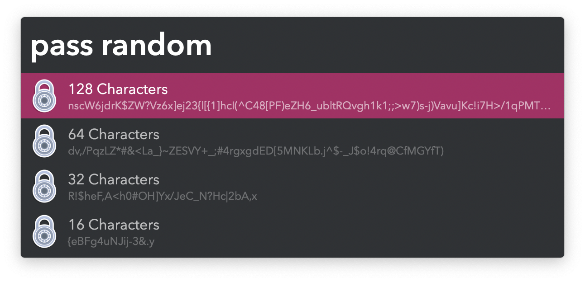
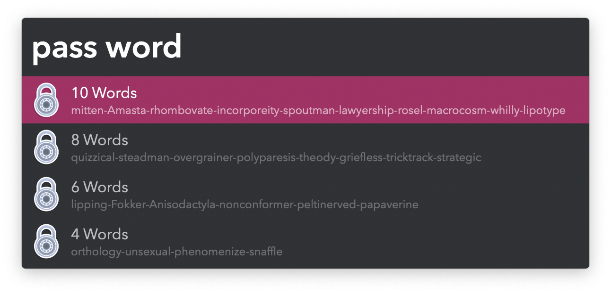

#  Strong Password Alfred Workflow

Generate random and word-based passwords

[⤓ Install on the Alfred Gallery](https://alfred.app/workflows/vitor/strong-password)

## Usage

Generate a set of random character passwords via the `pass random` keyword.

* <kbd>↩&#xFE0E;</kbd> Copy password with special charactes.
* <kbd>⌘</kbd><kbd>↩&#xFE0E;</kbd> Copy password without special charactes.

Generate a set of word-based passwords via the `pass word` keyword.

* <kbd>↩&#xFE0E;</kbd> Copy password.
